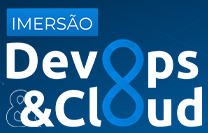

<p align="center">
  
</p>

<p align="center">
  <strong>Imersão DevOps && Cloud</strong>
</p>

# Technologies

- [Docker](https://www.docker.com/)
- [Kubernetes](https://kubernetes.io/)
- [AWS](https://aws.amazon.com/)
- [GitHub Actions](https://github.com/features/actions)
- [Terraform](https://www.terraform.io/)

# Content

## Revolução Digital com DevOps e Docker

## Kubernetes: do zero ao deploy

Comando para criar o cluster com k3d e executar a aplicação:
```Bash
k3d cluster create <cluster-name> -p "8080:30000@loadbalancer"
```

## AWS: Potencialize sua aplicação com Cloud Computing

Template de rede para o EKS do CloudFormations:

https://s3.us-west-2.amazonaws.com/amazon-eks/cloudformation/2020-10-29/amazon-eks-vpc-private-subnets.yaml

## GitHub Actions: Eficiência em entregas automatizadas

## Terraform: Produtividade com automação de Infra as Code

# Credits

Project made by [@lguima](https://github.com/lguima) during the **Imersão DevOps && Cloud** by [Fabricio Veronez
](https://github.com/fabricioveronez).

# License

Code under license [GPL-3.0](LICENSE.md).

---

<h3 align="center">
  Lucas Guima
</h3>

<p align="center">
  <a href="https://www.linkedin.com/in/lucasguima/">
    
  </a>
</p>
